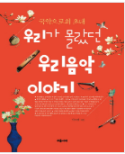
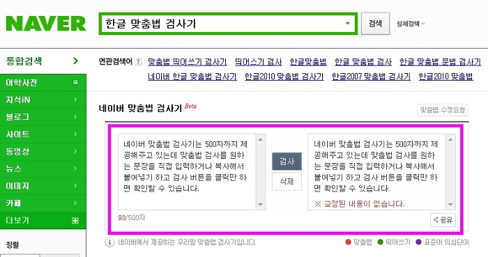

# 크롤링

## 도서 데이터 크롤링&파싱

<!-- <pre><code><pre/><code/>안에 코드를 넣으면 된다 -->
| 주제 |이미지를 누르면 관련사이트로 이동합니다.| 코드주소 |
|------|-----|----------|
|크롤링|<a href="https://www.culture.go.kr/knowledge/bookList.do" target="_blank">|[도서DATA크롤링](https://github.com/kwong3528/Web-Scraping/blob/master/%EB%8F%84%EC%84%9C%EB%8D%B0%EC%9D%B4%ED%84%B0%EB%A5%BC%20%ED%81%AC%EB%A1%A4%EB%A7%81%20%ED%95%B4%EB%B3%B4%EC%9E%90/%EB%8F%84%EC%84%9Cdata%20%ED%81%AC%EB%A1%A4%EB%A7%81.ipynb)|

#### 이 프로젝트는 책관련 프로젝트를 진행중에 관련 DATA가 필요하여 시작하였습니다.

---------------

## 파이썬으로 네이버 맞춤법 교정해보기

<!-- <pre><code><pre/><code/>안에 코드를 넣으면 된다 -->
| 주제 |공부를 목적으로 코딩을 해보았습니다.| 코드주소 |
|------|-----|----------|
|크롤링||[네이버 맞춤법 교정기](https://github.com/kwong3528/Web-Scraping/blob/master/%EB%84%A4%EC%9D%B4%EB%B2%84%20%EB%A7%9E%EC%B6%A4%EB%B2%95%20%EA%B5%90%EC%A0%95%EA%B8%B0%EB%A5%BC%20%EC%9E%90%EB%8F%99%ED%99%94%ED%95%B4%EB%B3%B4%EC%9E%90/%EB%84%A4%EC%9D%B4%EB%B2%84%EB%A7%9E%EC%B6%A4%EB%B2%95%EA%B5%90%EC%A0%95.ipynb)|

#### 대량의 텍스트들을 맞춤법 교정기로 돌려볼 수 있습니다.
#### 한번에 500자 이상 사용 할 수 없습니다.
